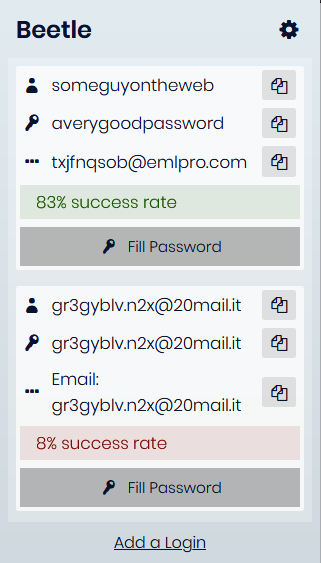

# Beetle

Beetle is a WebExtension which allows you to quickly grab logins from BugMeNot for the current tab.

## Installation

### ⬇ [Install for Firefox](https://addons.mozilla.org/en-US/firefox/addon/beetle/)

### ⬇ [Download .zip file](https://github.com/ShadyThGod/beetle/releases/download/1.0.0/beetle.zip)

## Screenshots

## FAQ

### Why is this not on Chrome?

The extension itself is completely compatible with Chrome, but I haven't been able to publish it to the Chrome Web Store. Chrome doesn't allow extensions to be loaded from the filesystem; only from the Web Store itself. However, the Web Store charges a registration fee, which to be blunt with you, I cannot afford. And yes, I know it's only $5 but I'm just a student living with my parents. I don't earn any money yet and even the work I put on GitHub is free of cost.

- Will I ever put on the Store then? 

Maybe, yes. You can expect to see this on the store by the end of this year or start of next year, if the extension doesn't completely break and is maintainable.
   
### How do I install it on Chrome?

If you're on a Windows system you can follow these steps:

- Download the [chrome-install-windows.zip](https://github.com/ShadyThGod/beetle/raw/master/dist/chrome-install-windows.zip) file and unzip it to a folder.
  - Unzip it to a folder which you won't delete later, as the .crx file will need to stay in that exact place.
- Right-click `install.ps1` and click "Run PowerShell Script"
  - If the option doesn't show up for you, you can [follow these instructions](https://stackoverflow.com/a/2035209) to run the script.
  - Make sure to run the script as an Administrator.
- Once you run the script, a dialog will pop-up asking you whether you want to make changes to the registry.
  - Click on `Yes`
- The script will install the extension.
- Close Chrome and re-open it if it was already open.
- If Chrome has disabled the extension, go to `chrome://extensions` in your browser and:
  - Remove the "Beetle" extension.
  - Drag the `beetle.crx` file in the unzipped folder onto the Extensions page.
- It should work just fine.

If you don't want to go through all that hassle, you might want to try this:

- Download the [beetle.zip](https://github.com/ShadyThGod/beetle/releases/download/1.0.0/beetle.zip) file and un-zip it to a folder which you won't delete.
- Go to `chrome://extensions` in Chrome.
- Enable `Developer Mode`.
- Click on **_Load Unpacked_** and select the folder where you un-zipped the file.
- It should now be added.
