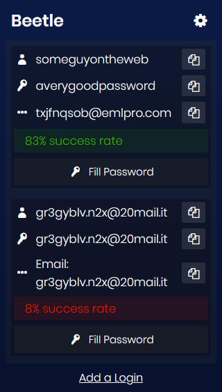

# Beetle

Beetle is a WebExtension which allows you to quickly grab logins from BugMeNot for the current tab.

## Installation

### ⬇ [Install for Firefox](https://addons.mozilla.org/en-US/firefox/addon/beetle/)

## Screenshots

